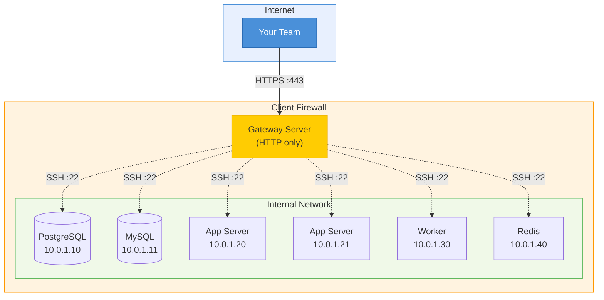
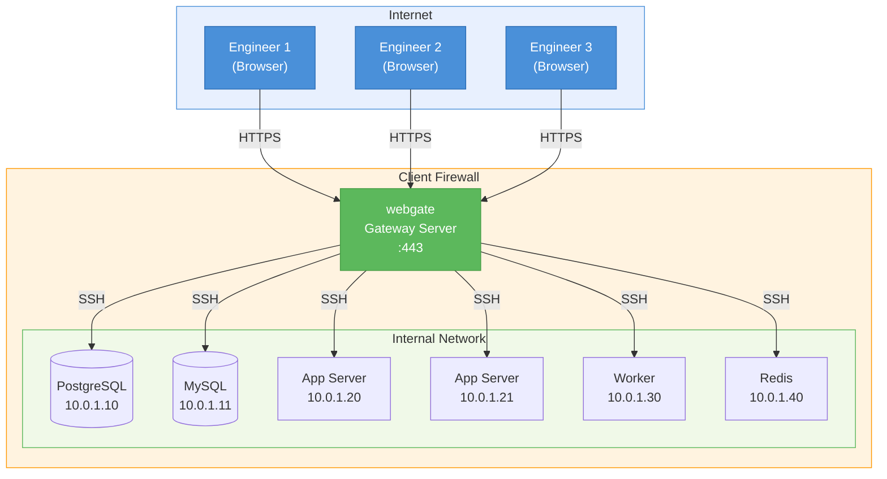
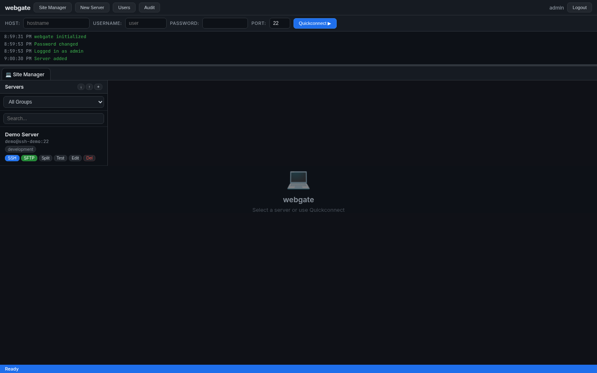
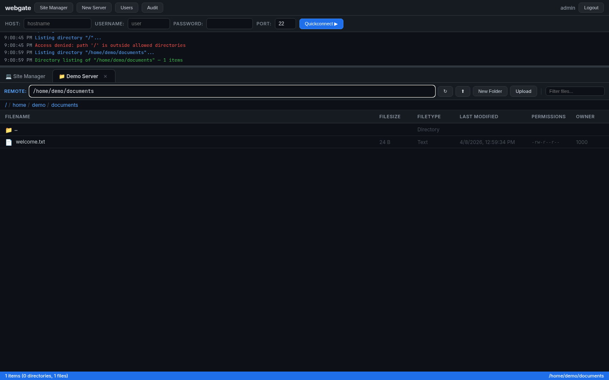
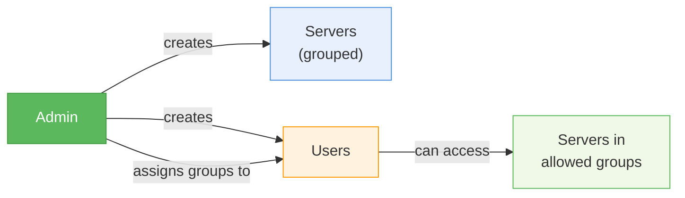
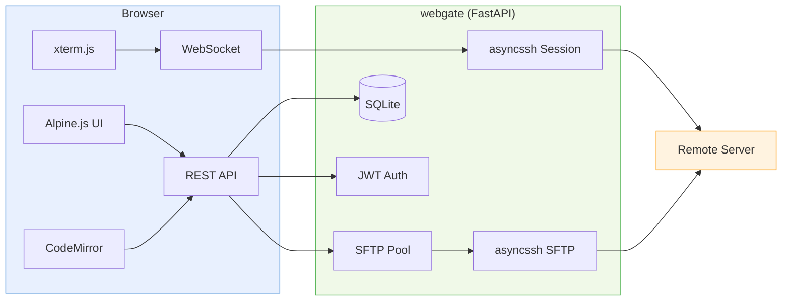

# webgate

[](https://pypi.org/project/webgate/)
[](https://pypi.org/project/webgate/)
[](https://github.com/kalexnolasco/webgate/blob/main/LICENSE)
[](https://fastapi.tiangolo.com)
[](Dockerfile)
[](https://pypi.org/project/webgate/)
[](https://github.com/kalexnolasco/webgate/actions)
[](https://kalexnolasco.github.io/webgate/)

Self-hosted web application for remote server management via **SSH terminal** and **SFTP file browser**. A modern Python replacement combining the best of [webssh](https://github.com/huashengdun/webssh) and [filebrowser](https://github.com/filebrowser/filebrowser) into a single unified tool with a FileZilla-inspired interface.

> **Documentation: [kalexnolasco.github.io/webgate](https://kalexnolasco.github.io/webgate/)**

---

## Why webgate?

Managing remote servers often means juggling SSH clients, SFTP tools, credentials, and VPN configs across your team. In many real-world scenarios, **direct SSH access to every server isn't possible** -- you only have HTTP/HTTPS access to a single entry point.

### The problem

A typical client infrastructure looks like this: a network of internal servers (databases, application servers, workers, etc.) behind a firewall, with only **one server exposed via HTTP**. Your team needs to manage all of them, but each engineer would need VPN access, local SSH clients, and credential management.



### The solution

Deploy **webgate** on the gateway server. Your entire team gets browser-based SSH and SFTP access to every internal server -- no VPN, no local SSH clients, no credential files scattered across laptops.



### Use cases

| Scenario | How webgate helps |
|----------|-------------------|
| **Client with restricted access** | Deploy on the only HTTP-accessible server, reach all internal machines via SSH/SFTP |
| **On-call / incident response** | Open a browser from any device, connect instantly -- no laptop with SSH keys needed |
| **Team onboarding** | Admin creates a user, assigns groups -- new engineer has access in seconds |
| **Audit & compliance** | Centralized access point, all connections go through one managed gateway |
| **Air-gapped environments** | Only needs outbound HTTP from the gateway, no inbound ports on internal servers |
| **Multi-client management** | Run separate webgate instances per client, each with its own server registry |

---

## Features

| Category | Capabilities |
|----------|-------------|
| **SSH Web Terminal** | Browser-based terminal via xterm.js + asyncssh, resize handling, copy/paste, multi-tab sessions |
| **SFTP File Browser** | Directory listing, upload/download, drag & drop, rename, delete, mkdir, chmod, breadcrumb navigation |
| **File Editor** | In-browser text editor powered by CodeMirror 6 with syntax highlighting (oneDark theme) |
| **File Preview** | PDF viewer, image preview (PNG, JPG, GIF, SVG, WebP) directly in the browser |
| **Server Registry** | Add/edit/delete servers, groups, tags, password & key auth, test connectivity, import/export, per-server SSH/SFTP toggles |
| **Quick Connect** | One-off SSH/SFTP connections without saving server config (FileZilla-style toolbar) |
| **Access Control** | Admin creates users, assigns server groups, enables/disables SSH or SFTP per server, restricts SFTP to specific paths, read-only SFTP mode |
| **Server Monitoring** | Background SSH connectivity checks every 60s, green/red status dot on server dashboard |
| **Dark/Light Theme** | Toggle between dark and light themes, saved in localStorage, terminal adapts |
| **Credential Security** | SSH passwords and private keys encrypted at rest with Fernet (derived from app secret) |
| **Connection Pool** | SFTP connections are reused per server (5 min TTL), not opened/closed on every request |
| **Upload Progress** | Visual progress bar with percentage during file uploads |
| **ZIP Download** | Download entire directories as ZIP archives from the SFTP browser |
| **Keyboard Shortcuts** | Escape closes modals, Ctrl+1 Site Manager, Ctrl+N New Server |
| **Docker Ready** | Multi-stage Dockerfile, single-command deployment, health checks, persistent volumes |
| **Responsive** | Adapts to tablet and mobile screen sizes |
| **Zero Frontend Build** | Vanilla JS + Alpine.js, no npm/node required, all assets from CDN |

## Screenshots

### Login


### Site Manager


### SSH Terminal


### SFTP File Browser


### File Editor (CodeMirror 6)


### Split View (Terminal + SFTP)


### Access Control (per-server SSH/SFTP toggles + path restrictions)


### SSH Disabled (button greyed out)


### SFTP Path Restriction in Action


### User Management


### Audit Log


## Quick Start

### Docker (recommended)

```bash
# Clone and run
git clone https://gitlab.wdna.com/wdna/webgate.git
cd webgate
docker compose up -d

# Open http://localhost:8443
# Login with admin / admin (you'll be asked to change the password)
```

> **Important:** On first launch, webgate creates a default `admin` / `admin` account. You will be forced to change the password on first login. Set a strong secret key in production:

```bash
WEBGATE_SECRET_KEY=$(openssl rand -hex 32) docker compose up -d
```

### Development with SSH demo server

A `compose.dev.yml` is included with a demo SSH container for testing:

```bash
docker compose -f compose.dev.yml up -d
# webgate at :8443 + SSH demo server (user: demo, password: demo)
```

### Local Development

```bash
# Install dependencies
uv sync

# Run dev server with auto-reload
uv run uvicorn webgate.app:create_app --factory --reload --host 0.0.0.0 --port 8443

# Or simply
uv run python -m webgate
```

## User Management

webgate uses a **role-based access model** with two roles: **admin** and **user**.

### How it works



| | Admin | User |
|---|---|---|
| Add/edit/delete servers | Yes | No |
| Enable/disable SSH or SFTP per server | Yes | No |
| Restrict SFTP to specific paths | Yes | No |
| Create/delete users | Yes | No |
| Assign groups to users | Yes | No |
| See all servers | Yes | Only servers in assigned groups |
| SSH terminal (if enabled on server) | Yes | Yes (allowed servers only) |
| SFTP file browser (if enabled, within allowed paths) | Yes | Yes (allowed servers only) |
| Quick Connect | Yes | Yes |

### Example workflow

1. **Admin** logs in (default `admin`/`admin`, forced to change password)
2. **Admin** adds servers and organizes them into groups (`production`, `staging`, `dev`)
3. **Admin** creates users and assigns groups:
   - `alice` -> `production`, `staging` (senior engineer)
   - `bob` -> `staging`, `dev` (junior, no prod access)
   - `charlie` -> `production` (read-only ops, only prod)
4. Each user logs in and sees **only** the servers in their assigned groups

## Architecture

```
webgate/
├── src/webgate/
│   ├── __main__.py          # Entry point: uvicorn launcher
│   ├── app.py               # FastAPI app factory, lifespan, middleware
│   ├── config.py            # Pydantic Settings (env vars, defaults)
│   ├── auth/                # JWT auth, user management, admin routes
│   │   ├── models.py        # User model + Pydantic schemas
│   │   ├── service.py       # Password hashing, JWT, seed_admin, CRUD
│   │   └── routes.py        # Login, change-password, admin user CRUD
│   ├── servers/             # Server registry CRUD, connectivity test
│   │   ├── models.py        # Server model + schemas
│   │   ├── service.py       # CRUD with group-based filtering
│   │   └── crypto.py        # Fernet encrypt/decrypt for credentials
│   ├── terminal/            # WebSocket SSH bridge (xterm.js <-> asyncssh)
│   ├── files/               # SFTP operations with connection pooling
│   │   ├── sftp_service.py  # SFTP client wrapper
│   │   ├── pool.py          # Connection pool (reuse per server, 5min TTL)
│   │   └── routes.py        # REST API: ls, read, write, upload, download, chmod
│   ├── db/                  # SQLAlchemy async engine + session factory
│   └── static/              # Frontend (single index.html, FileZilla-style UI)
├── tests/
├── Dockerfile               # Multi-stage build (python:3.13-slim)
├── Dockerfile.ssh-demo      # Demo SSH container for development
├── compose.yml              # Production deployment
├── compose.dev.yml          # Development with SSH demo server
└── pyproject.toml
```



## API Reference

### Auth

| Method | Endpoint | Description |
|--------|----------|-------------|
| `POST` | `/api/auth/login` | Login, returns JWT token |
| `GET` | `/api/auth/me` | Current user info (includes `must_change_password`) |
| `POST` | `/api/auth/change-password` | Change own password |
| `GET` | `/api/auth/users` | List all users (admin only) |
| `POST` | `/api/auth/users` | Create user with allowed groups (admin only) |
| `PUT` | `/api/auth/users/{id}/groups` | Update user's allowed groups (admin only) |
| `PUT` | `/api/auth/users/{id}/password` | Reset user's password (admin only) |
| `DELETE` | `/api/auth/users/{id}` | Delete user (admin only) |
| `GET` | `/api/auth/audit` | Audit log with filters (admin only) |

### Server Registry

| Method | Endpoint | Description |
|--------|----------|-------------|
| `GET` | `/api/servers` | List servers (filtered by user's allowed groups) |
| `POST` | `/api/servers` | Create server (admin only) |
| `GET` | `/api/servers/{id}` | Server details |
| `PUT` | `/api/servers/{id}` | Update server (admin only) |
| `DELETE` | `/api/servers/{id}` | Delete server (admin only) |
| `POST` | `/api/servers/{id}/test` | Test SSH connectivity |
| `GET` | `/api/servers/groups` | List groups (filtered by user's access) |
| `POST` | `/api/servers/import` | Bulk import (admin only) |
| `GET` | `/api/servers/export` | Export all servers (admin only) |

### Terminal (WebSocket)

| Method | Endpoint | Description |
|--------|----------|-------------|
| `WS` | `/api/ws/terminal/{server_id}` | SSH terminal to saved server |
| `WS` | `/api/ws/terminal/quick` | Quick connect with inline credentials |

### SFTP File Manager

| Method | Endpoint | Description |
|--------|----------|-------------|
| `GET` | `/api/files/{id}/ls?path=` | Directory listing |
| `GET` | `/api/files/{id}/read?path=` | Read text file |
| `GET` | `/api/files/{id}/download?path=` | Download file |
| `POST` | `/api/files/{id}/upload?path=` | Upload files (multipart) |
| `PUT` | `/api/files/{id}/write` | Save text file |
| `POST` | `/api/files/{id}/mkdir` | Create directory |
| `POST` | `/api/files/{id}/rename` | Rename/move |
| `DELETE` | `/api/files/{id}/delete?path=` | Delete file/directory |
| `POST` | `/api/files/{id}/chmod` | Change permissions |
| `GET` | `/api/files/{id}/stat?path=` | File metadata |

### Health

| Method | Endpoint | Description |
|--------|----------|-------------|
| `GET` | `/api/health` | Health check (`{"status": "ok"}`) |

## Configuration

All settings are configurable via environment variables with the `WEBGATE_` prefix:

| Variable | Default | Description |
|----------|---------|-------------|
| `WEBGATE_HOST` | `0.0.0.0` | Server bind address |
| `WEBGATE_PORT` | `8443` | Server port |
| `WEBGATE_SECRET_KEY` | `change-me-in-production` | JWT signing + Fernet encryption key |
| `WEBGATE_DB_URL` | `sqlite+aiosqlite:///./webgate.db` | Database URL |
| `WEBGATE_ALLOWED_ORIGINS` | `*` | CORS origins (comma-separated) |
| `WEBGATE_LOG_LEVEL` | `info` | Log level |
| `WEBGATE_SESSION_TIMEOUT` | `3600` | SSH session timeout (seconds) |
| `WEBGATE_MAX_UPLOAD_SIZE` | `104857600` | Max upload size (100 MB) |
| `WEBGATE_JWT_ALGORITHM` | `HS256` | JWT algorithm |
| `WEBGATE_JWT_EXPIRE_MINUTES` | `1440` | Token expiry (24 hours) |
| `WEBGATE_MONITOR_INTERVAL` | `60` | Server status check interval (seconds) |
| `WEBGATE_MONITOR_TIMEOUT` | `5` | SSH connect timeout for checks (seconds) |
| `WEBGATE_MONITOR_CONCURRENCY` | `10` | Max parallel status checks |

## Docker

### Build and Run

```bash
docker compose up -d
# Login at http://localhost:8443 with admin / admin
```

### Production with TLS (Caddy reverse proxy)

```yaml
# compose.yml
services:
  webgate:
    build: .
    container_name: webgate
    restart: unless-stopped
    ports:
      - "8443:8443"
    volumes:
      - webgate-data:/data
    environment:
      WEBGATE_SECRET_KEY: "${WEBGATE_SECRET_KEY}"

  caddy:
    image: caddy:2-alpine
    restart: unless-stopped
    ports:
      - "443:443"
      - "80:80"
    volumes:
      - ./Caddyfile:/etc/caddy/Caddyfile
      - caddy-data:/data

volumes:
  webgate-data:
  caddy-data:
```

```
# Caddyfile
webgate.example.com {
    reverse_proxy webgate:8443
}
```

### Useful Commands

```bash
docker compose logs -f webgate    # View logs
docker compose down               # Stop (data preserved)
docker compose down -v            # Stop + delete data (fresh start)
docker compose build --no-cache   # Rebuild from scratch
```

## Development

```bash
# Install with dev dependencies
uv sync

# Run with auto-reload
uv run uvicorn webgate.app:create_app --factory --reload --host 0.0.0.0 --port 8443

# Run with demo SSH server
docker compose -f compose.dev.yml up -d

# Lint & format
uv run ruff check src/ tests/
uv run ruff format src/ tests/

# Type check
uv run pyright src/

# Test
uv run pytest tests/ -v

# Test with coverage
uv run coverage run -m pytest tests/ -v && uv run coverage report
```

## Tech Stack

| Layer | Technology |
|-------|-----------|
| **Backend** | Python 3.11+, FastAPI, uvicorn, asyncssh, SQLAlchemy, aiosqlite, Pydantic v2 |
| **Auth** | JWT (python-jose), bcrypt, Fernet (cryptography), slowapi (rate limiting) |
| **Frontend** | Vanilla JS, Alpine.js, xterm.js, CodeMirror 6 |
| **Database** | SQLite (default), any SQLAlchemy-supported DB |
| **Container** | Docker, multi-stage build, python:3.13-slim |

## Security

- **Default admin password forced change** -- `admin`/`admin` is temporary, must be changed on first login
- **SSH credentials encrypted at rest** with Fernet (key derived from `WEBGATE_SECRET_KEY`)
- **JWT authentication** with configurable expiry
- **Group-based access control** -- users only see servers in their assigned groups
- **Per-server feature control** -- admin can disable SSH or SFTP independently per server
- **SFTP path restrictions** -- admin can lock SFTP to specific directories per server
- **SFTP read-only mode** -- admin can set per-server read-only flag, blocking all write operations
- **SFTP path traversal protection** (server-side normalization and validation)
- **CORS configurable** per deployment
- **No plaintext password storage** (user passwords hashed with bcrypt)
- **Admin-only server management** -- regular users cannot add, edit, or delete servers

## Roadmap

### Completed (v0.1.x)

- [x] SSH web terminal (xterm.js + asyncssh)
- [x] SFTP file browser with full CRUD
- [x] Server registry with groups and tags
- [x] In-browser text editor (CodeMirror 6)
- [x] PDF and image preview
- [x] Quick connect toolbar
- [x] Docker deployment
- [x] JWT authentication with forced password change
- [x] Fernet credential encryption
- [x] Admin user management with group-based access
- [x] SFTP connection pool (reuse connections, 5 min TTL)
- [x] Multi-tab split pane (terminal + files side by side)
- [x] SSH key management (per-server key upload with visual indicator)
- [x] File search / filter within SFTP listings
- [x] Server import/export from UI (JSON)
- [x] Session persistence across page reloads
- [x] Rate limiting on auth endpoints (slowapi)
- [x] Audit log (admin-viewable action history)
- [x] Per-server SSH/SFTP toggles (admin can enable/disable each feature)
- [x] SFTP path restrictions (admin can limit access to specific directories)

### Completed (v0.2.x)

- [x] SFTP read-only mode per server (browse and download only)
- [x] Server status monitoring (background SSH checks, green/red dot)
- [x] Dark/light theme toggle with localStorage persistence
- [x] Responsive tablet/mobile layout
- [x] Keyboard shortcuts (Escape, Ctrl+1, Ctrl+N)
- [x] Upload progress bar with percentage
- [x] Folder download as ZIP

### Planned (v0.3.x -- Collaboration & Ops)

- [ ] Shared terminal sessions (multiple users watching the same session)
- [ ] Session recording and playback (audit/training)
- [ ] SSH command snippets/macros (saved per server or global)
- [ ] Webhook/notifications on connection events
- [ ] Two-factor authentication (TOTP)
- [ ] LDAP/Active Directory integration
- [ ] API key authentication (for automation/scripts)

### Planned (v0.4.x -- Enterprise)

- [ ] PostgreSQL support (tested and documented)
- [ ] Multi-instance deployment with shared DB
- [ ] SSH jump host / bastion support (ProxyCommand equivalent)
- [ ] Custom branding (logo, colors, company name)
- [ ] Backup/restore UI for server registry
- [ ] Internationalization (i18n)

## Requirements

- Python 3.11+
- Linux, macOS, or WSL (asyncssh requires Unix-like OS)
- Target servers must have SSH enabled

## License

MIT

---

**webgate** -- Remote server management, simplified.
