# Local testing playground

A single Docker Compose file spins up webgate alongside **every supporting service it can talk to**, so you can exercise every feature end-to-end without touching a real server:

- **2 SSH targets** on a public network (`ssh-demo`, `ssh-bastion`)
- **1 SSH target on a private network** (`ssh-internal`) that webgate **cannot reach directly** — proves the jump-host tunnel is real
- **OpenLDAP** pre-seeded with `alice` (admin) and `bob` (non-admin)
- **HTTP echo server** to receive webhooks and show their payload
- **Session recording** turned on so every SSH session is captured to an asciinema cast

## Bring up the stack

```bash
docker compose -f compose.playground.yml up -d --build
```

After ~20 seconds:

```
$ curl -s http://localhost:8443/api/health
{"status":"ok","instance_id":"...","monitor_role":"leader"}
```

Available credentials (printed in `docker logs pg-ldap-seed`):

| User | Password | Origin | Role |
|---|---|---|---|
| **alice** | `alicepass` | LDAP | admin (auto-provisioned) |
| **bob** | `bobpass` | LDAP | non-admin (group `production`) |
| **admin** | `admin` | local | admin (first-login password change) |

---

## Network topology

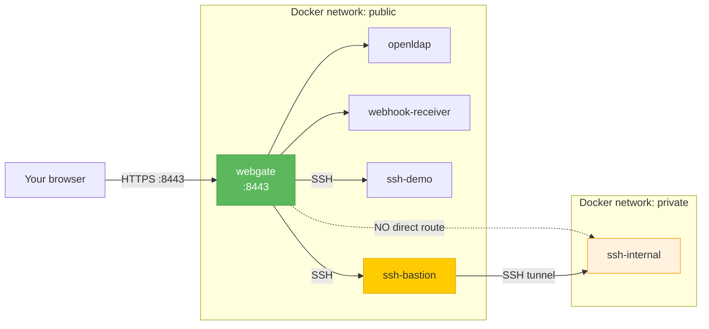

`webgate` and `ssh-internal` share **no network**, so reaching `ssh-internal` is only possible via the bastion.

---

## 1 · LDAP login (no local account needed)

Log in directly as an LDAP user. The `alice` row doesn't exist in webgate's local DB on first startup — LDAP auth succeeds, the local row is auto-provisioned, and the LDAP group memberships are mapped into `allowed_groups` and `is_admin`.

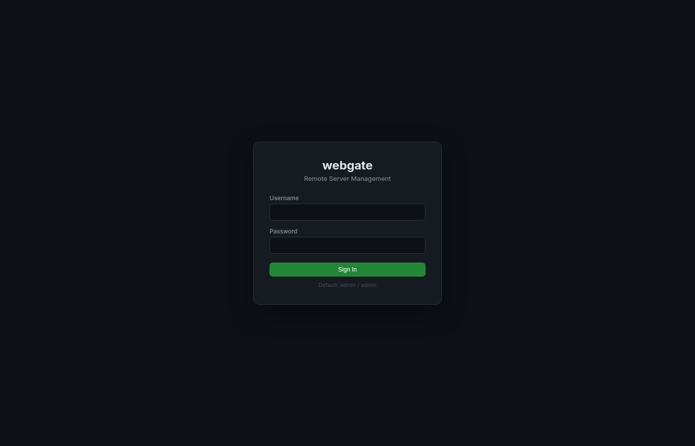

```bash
# Verify the auto-provisioned identity
TOKEN=$(curl -s -X POST http://localhost:8443/api/auth/login \
  -H 'Content-Type: application/json' \
  -d '{"username":"alice","password":"alicepass"}' | jq -r .access_token)
curl -s http://localhost:8443/api/auth/me -H "Authorization: Bearer $TOKEN" | jq
# {
#   "username": "alice",
#   "is_admin": true,
#   "allowed_groups": ["all", "production"]  ← mapped from LDAP groups admins + devs
# }
```

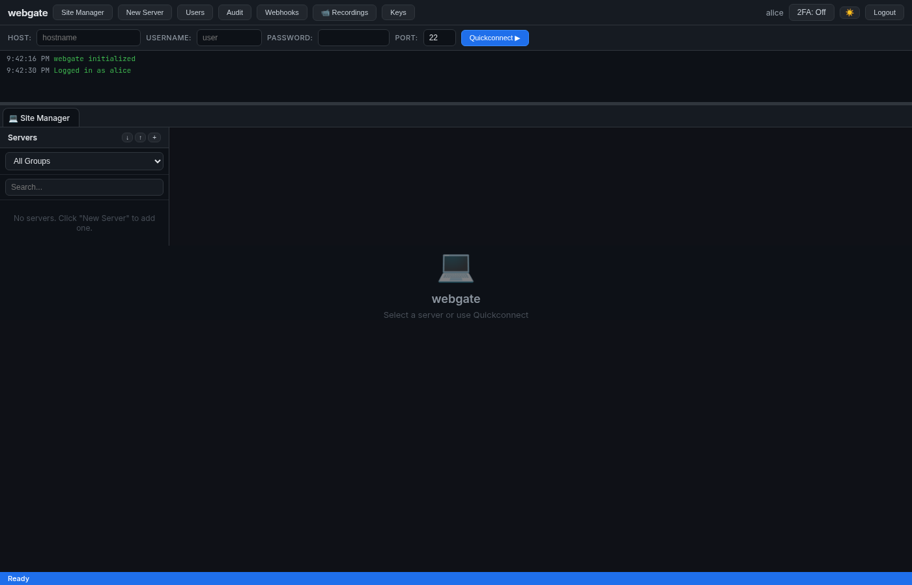

---

## 2 · Add 3 servers (including a jump-host)

Via the UI (Site Manager → New Server) or via API:

```bash
# demo-server  (reachable directly)
curl -X POST http://localhost:8443/api/servers -H "Authorization: Bearer $TOKEN" -H 'Content-Type: application/json' \
  -d '{"name":"demo-server","hostname":"ssh-demo","port":22,"username":"demo","password":"demo","group":"all"}'

# bastion (reachable directly, public)
curl -X POST http://localhost:8443/api/servers -H "Authorization: Bearer $TOKEN" -H 'Content-Type: application/json' \
  -d '{"name":"bastion","hostname":"ssh-bastion","port":22,"username":"demo","password":"demo","group":"all"}'

# internal-app  (only reachable VIA bastion)
curl -X POST http://localhost:8443/api/servers -H "Authorization: Bearer $TOKEN" -H 'Content-Type: application/json' \
  -d '{"name":"internal-app","hostname":"ssh-internal","port":22,"username":"demo","password":"demo","group":"production","jump_via_id":2}'
```

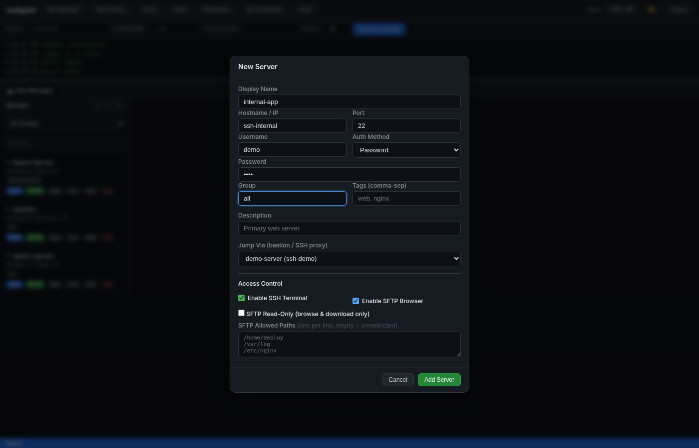


### Prove the jump-host is real

```bash
# webgate cannot resolve ssh-internal directly:
docker exec pg-webgate sh -c 'getent hosts ssh-internal'
# → (empty / "not resolvable")

# But connectivity test succeeds because it tunnels through the bastion:
for id in 1 2 3; do
  curl -s -X POST "http://localhost:8443/api/servers/$id/test" \
    -H "Authorization: Bearer $TOKEN"
  echo
done
# server 1: {"success":true,"message":"Connection successful"}
# server 2: {"success":true,"message":"Connection successful"}
# server 3: {"success":true,"message":"Connection successful (via jump host)"}
```

---

## 3 · SSH terminal through the jump host

Click **SSH** on `internal-app`. Type `hostname` — you're inside the private server that webgate can't reach directly.

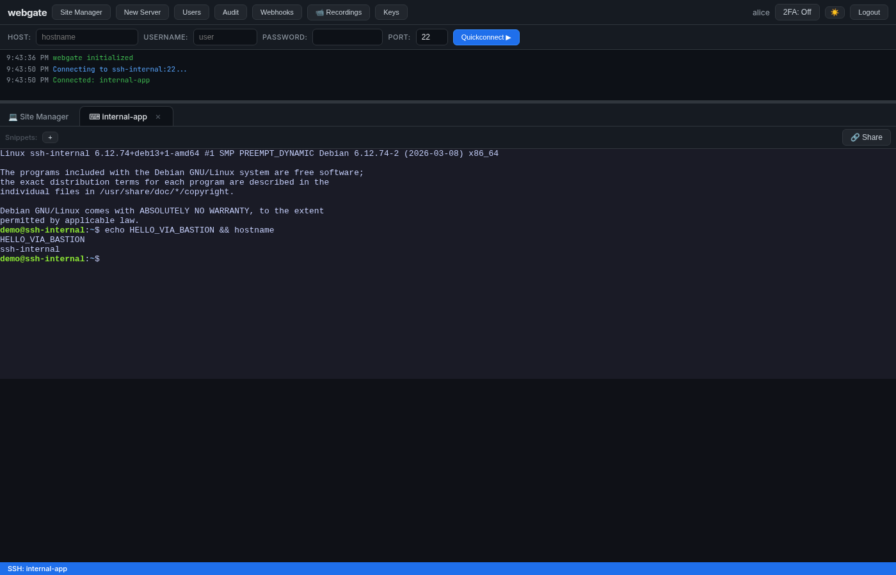

---

## 4 · Snippets

Create a few snippets (toolbar `+` button, or via API). Click a button to send `command + Enter` to the active session:

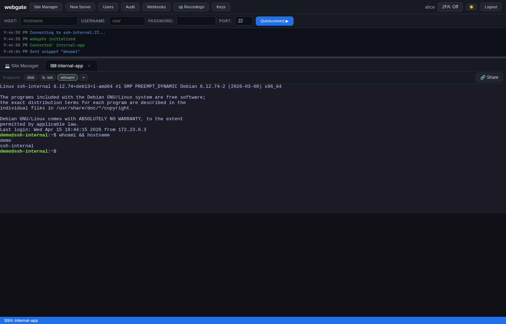

---

## 5 · Shared terminal session

1. In alice's terminal toolbar click **🔗 Share** → URL is copied to clipboard
2. Open the URL in another browser / incognito, log in as `bob`
3. bob's URL has `?join=<token>` → he attaches to the same live session in read-write mode

Both browsers broadcast **the same PTY output**:

| Owner (alice) | Joiner (bob) |
|---|---|
| 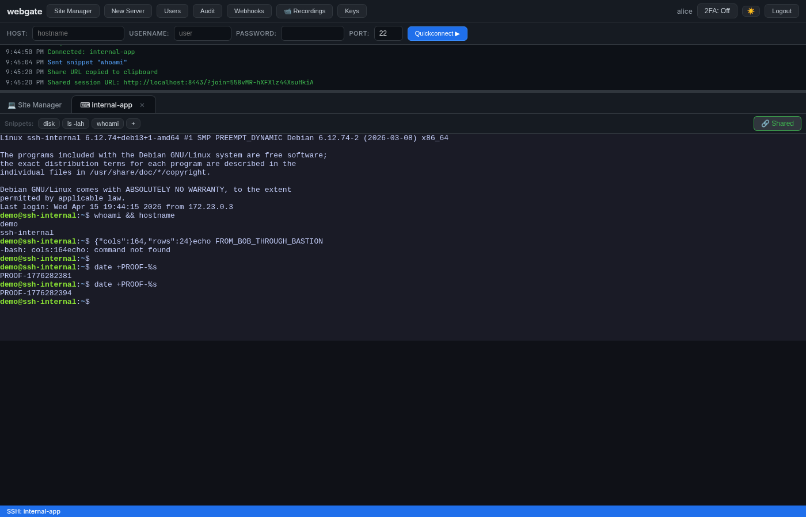 | 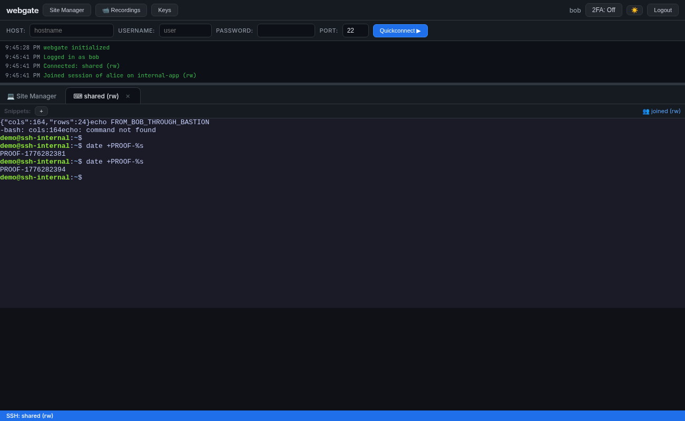 |

> Note both logs show `PROOF-1776282394` — the exact same `date +PROOF-%s` output, delivered by a single SSH PTY to two different WebSockets.

---

## 6 · Webhooks

Register a webhook pointing at the echo receiver, click **Test**, then check what the receiver saw:

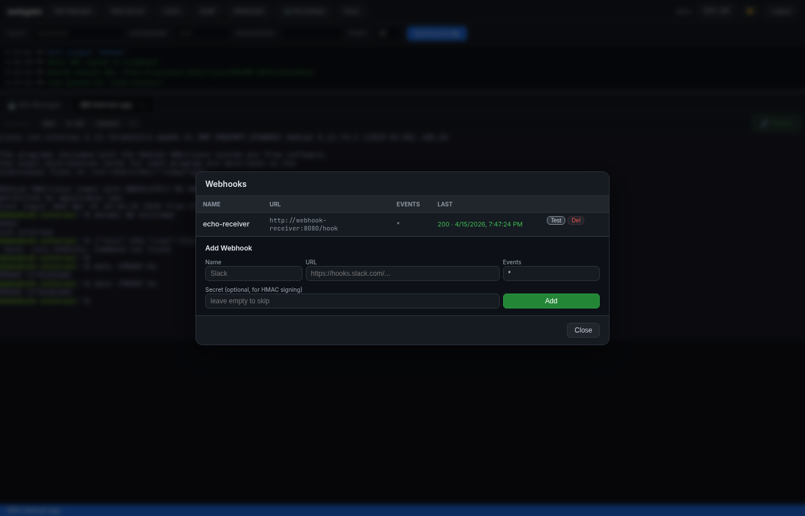

```bash
docker logs pg-webhook-receiver | grep -A 5 '"event": "test"'
# {
#   "event": "test",
#   "timestamp": "...",
#   "data": { "webhook_id": 1, "name": "echo-receiver", "triggered_by": "alice" }
# }
# X-Webgate-Signature: sha256=<hmac of body>  ← verifiable with the secret
```

Real events (`user_login`, `ssh_connect`, `server_added`, …) fire the same webhook automatically.

---

## 7 · Session recordings

Because `WEBGATE_RECORD_SESSIONS=true` was set in `compose.playground.yml`, every SSH session gets captured.

Open **📹 Recordings** in the top toolbar:

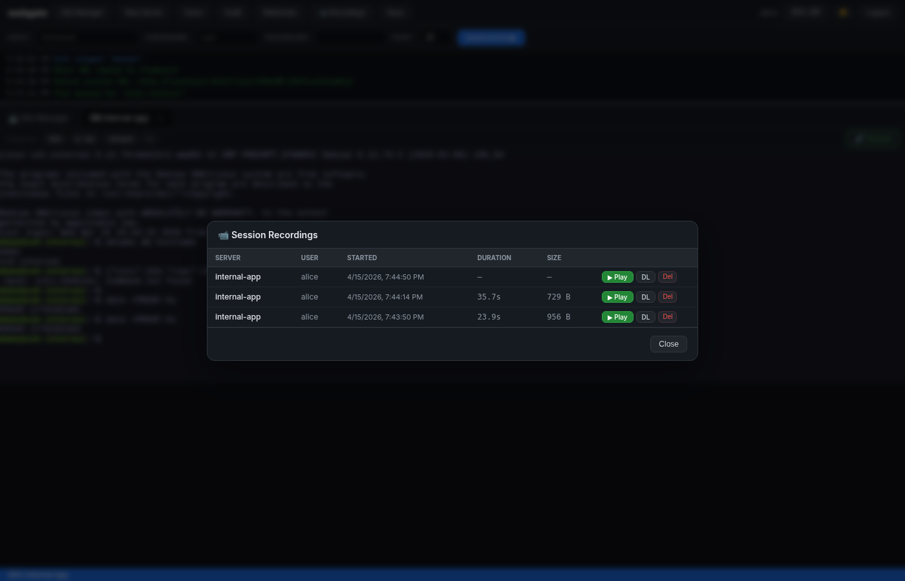

Click **▶ Play** to replay the session in the browser with asciinema-player:

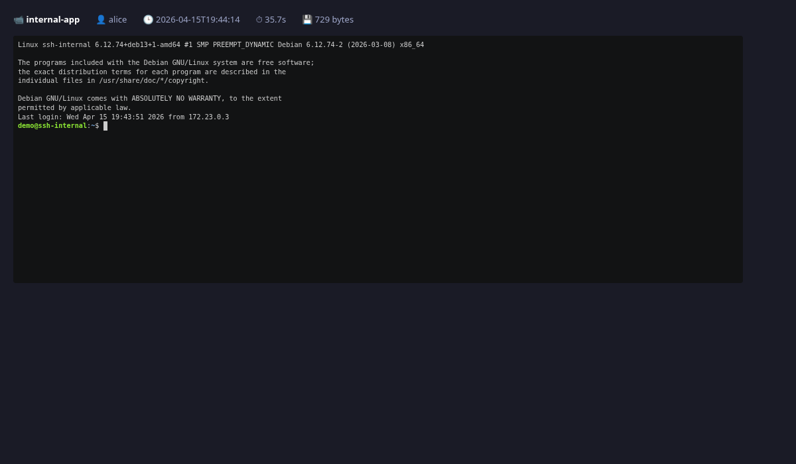

`.cast` files are plain asciinema v2 JSON Lines under `/data/recordings/` inside the container — you can download and `asciinema play` them locally too.

---

## 8 · Non-admin LDAP user — scoped visibility

Log in as `bob` (LDAP group `devs` → webgate group `production`):

```bash
curl -s http://localhost:8443/api/auth/me -H "Authorization: Bearer $TOKEN_BOB" | jq
# {
#   "username": "bob",
#   "is_admin": false,
#   "allowed_groups": ["production"]   ← only "devs" → "production" applies
# }

curl -s http://localhost:8443/api/servers -H "Authorization: Bearer $TOKEN_BOB"
# [ { "name": "internal-app", "group": "production" } ]
# ← bob does NOT see demo-server or bastion (both in group "all")
```


---

## Tear down

```bash
docker compose -f compose.playground.yml down -v
```

---

## Summary — what this playground proves

| Feature | How it's proven |
|---|---|
| **LDAP auth + auto-provision** | `alice`/`bob` never existed locally; log in works; `allowed_groups` + `is_admin` derived from LDAP groups |
| **Group-based access control** | bob (in LDAP `devs`) only sees servers in webgate group `production` |
| **Jump host / bastion** | webgate cannot resolve `ssh-internal`, yet the terminal + SFTP work through `bastion` |
| **Terminal + SFTP** | standard use: list files, edit, upload, download |
| **Snippets** | button click sends command to active PTY |
| **Shared terminal** | two browsers share one SSH session, output identical on both |
| **Webhooks** | receiver logs the POST with HMAC signature on events |
| **Session recording** | every SSH session captured to asciinema cast, browser replay works |
| **Dialect-aware DB** | playground uses SQLite; swap `WEBGATE_DB_URL` for Postgres transparently |
