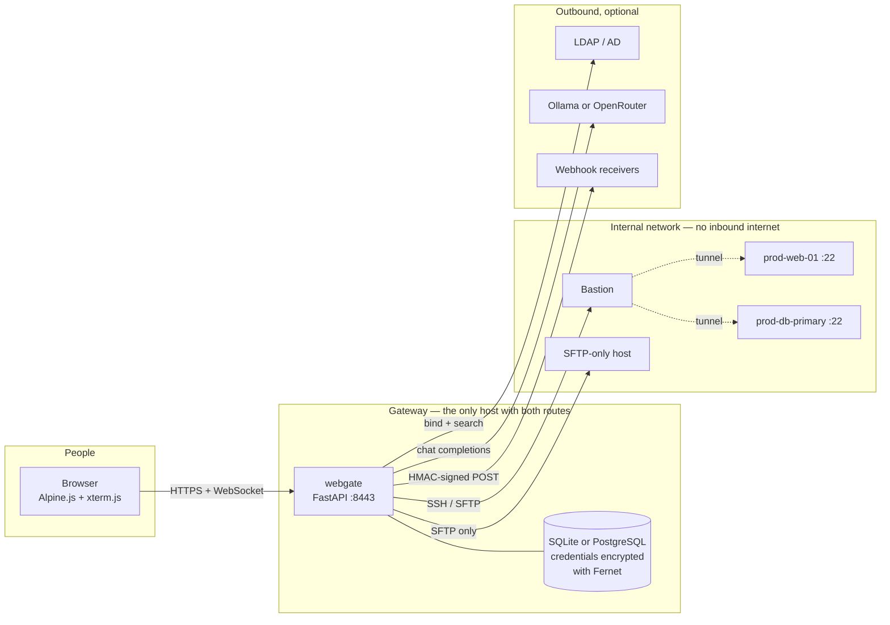
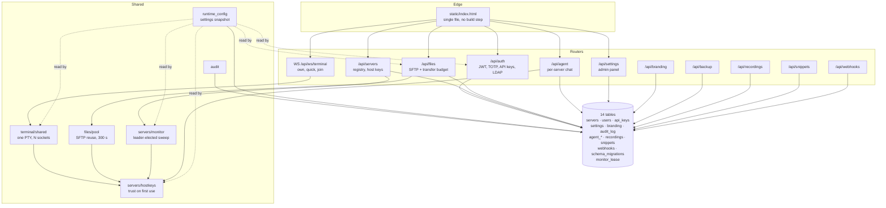
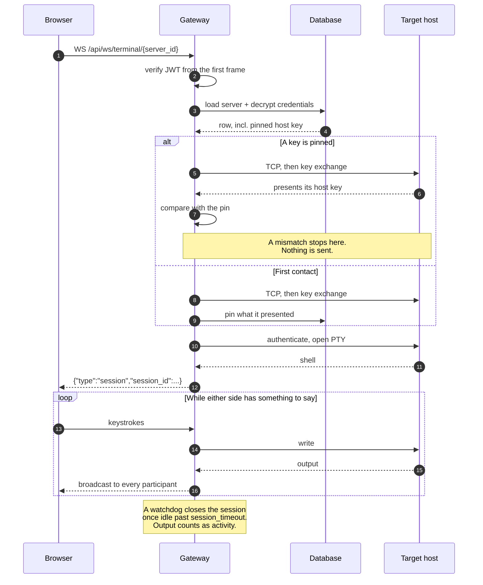
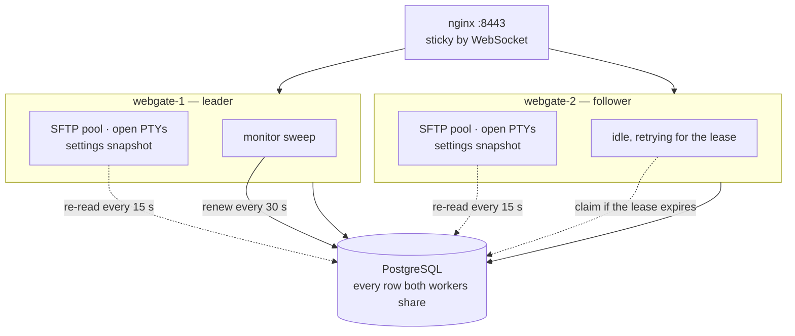
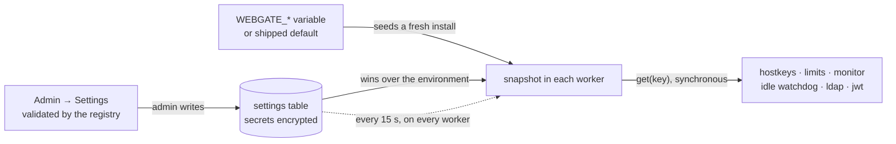

# Architecture

A self-hosted gateway that puts SSH and SFTP in a browser. One Python process holds
every credential in the fleet, so most of the design is about what that process is
allowed to do, and what happens when there is more than one of it.

| | |
|---|---|
| Backend | 8,345 lines across 66 files |
| Frontend | 3,733 lines, no build step |
| Surface | 10 REST routers + 3 WebSocket endpoints |
| Tables | 14 |
| Tests | 248 |

## What talks to what

Browsers speak HTTPS and WebSocket to one address. Everything behind it — SSH, SFTP,
LDAP, the model provider — is reached from the gateway, outbound. That is the point: in
most deployments the servers have no route to the internet and the people have no route
to the servers.



Only the gateway needs a route to the model provider — inspected hosts never do, because
the agent reaches them over SSH from here. Solid arrows are connections webgate opens;
the dotted ones are channels multiplexed inside a bastion connection.

!!! note "Nothing is installed on the targets"
    No agent, no daemon. A target only has to accept SSH, and some only accept SFTP —
    the AI agent carries a shell-free toolset for exactly those.

## What is inside

Each module is a router, a service and its own tables. The two shared pieces are the
session factory and the runtime settings snapshot; everything else talks through the
database.



`hostkeys` and `runtime_config` are the two things almost everything depends on: one
decides whether a connection is allowed to proceed, the other supplies the values it is
judged against.

### Project layout

```
src/webgate/
├── __main__.py          uvicorn launcher
├── app.py               FastAPI factory, lifespan, middleware
├── config.py            boot settings (env only); the rest live in the admin panel
├── agent/               per-server AI chat: provider, tools, SFTP-only tools, cache
├── audit/               immutable action log
├── auth/                JWT + bcrypt, 2FA TOTP, API keys, LDAP, user management
├── backup/              full-state export/import, passphrase-encrypted
├── branding/            white-label store: name, logo, colours, favicon
├── db/                  async engine + additive, append-only migrations
├── files/
│   ├── sftp_service.py  SFTP operations, chunked reads, ZIP builders
│   ├── pool.py          connection reuse, 300 s TTL
│   ├── limits.py        per-request transfer budget
│   └── routes.py        REST endpoints
├── recordings/          asciinema cast v2 writer + browser replay
├── runtime_config/
│   ├── registry.py      every setting an admin may change, with its validation
│   ├── store.py         key/value rows, encrypted secrets, in-process snapshot
│   └── routes.py        /api/settings
├── servers/
│   ├── hostkeys.py      trust-on-first-use pinning and verification
│   ├── monitor.py       leader-elected status sweep
│   ├── crypto.py        Fernet credential encryption
│   └── service.py       registry CRUD, jump-host resolution
├── snippets/            per-user command library
├── terminal/
│   ├── ssh_session.py   asyncssh wrapper, optional jump tunnel
│   ├── shared.py        SharedSession registry: 1 PTY <-> N WebSockets, idle watchdog
│   ├── ws_handler.py    input multiplex / output broadcast
│   └── routes.py        WS endpoints + share-token mint/revoke
├── webhooks/            HMAC-signed event dispatcher
└── static/index.html    single-file frontend (Alpine.js + xterm.js + CodeMirror)
```

## What happens on one request

The host key is checked before authentication runs, so a server presenting the wrong key
never receives the credentials. Everything after that is a pump between one WebSocket and
one PTY.



A share token turns the same session into a multi-participant one: joiners attach to the
existing PTY read loop rather than opening a second connection, so what everyone sees is
the same stream.

Host keys are exposed as fingerprints (`SHA256:LRG8dl…`), never as the key itself, and
clearing a pin is an admin-only, audited action. **Seven paths verify**: terminal, SFTP
browser, SFTP pool, status monitor, connection test, agent, and jump hosts — the bastion
most of all, since everything behind it rides that one connection.

## What happens with more than one

Any worker can serve any request. The two things that must not happen N times — sweeping
the fleet for status, and holding the truth about configuration — are handled by a lease
and by a re-read.



The lease outlives a full sweep by design — raise the check interval in the panel and the
lease stretches with it, or the leader would drop its own lease mid-sweep. Open sessions
and pooled SFTP connections are per-worker and do not survive one being replaced, which
is why rollouts go one worker at a time.

See [HA deployment](guide/ha.md) for the compose file and the nginx config.

## Where a setting's value comes from

Configuration is stored as key/value, so adding a setting needs no migration. Reads are
synchronous against an in-process snapshot, because they sit on paths like *is this
upload too big* that run per request.



`WEBGATE_CONFIG_LOCKED=true` removes the middle arrow: values stay visible so an operator
can see what is in force, but only the deployment can change them. Full detail in
[Settings](guide/settings.md).

## Why it is shaped this way

Four constraints decided most of the rest.

**1. The gateway is the credential store.** Every design question resolves against this.
It is why host keys are verified before authentication, why the Fernet key stays in the
environment, and why the agent's tools are read-only.

**2. Workers are interchangeable.** Nothing durable may live in memory or on a worker's
disk. State goes to the database; what stays local — pooled connections, open PTYs — is
reconstructible and expected to be lost.

**3. Migrations are additive, append-only, idempotent.** No column is ever dropped or
retyped, so an older release ignores what it does not know and a rollback is safe. The
contract is enforced by a test that upgrades an aged database and compares it against a
fresh install. See [Upgrading](getting-started/upgrade.md).

**4. The frontend has no build step.** One HTML file, Alpine and xterm from a CDN.
Cloning the repo and running it is the whole setup, and there is no compiled asset that
can drift from the source it came from.
