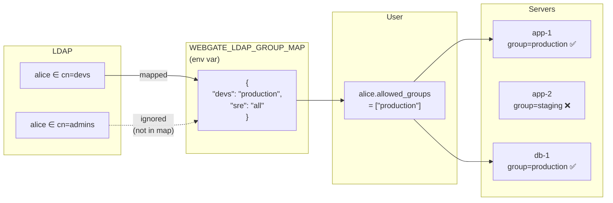

# Access model — groups, tags, LDAP

Three concepts, easy to mix up. Here is exactly how they fit together.

## The model

| Concept | Type | Defined by | What it does |
|---|---|---|---|
| `Server.group` | single string per server (e.g. `production`) | admin, in the **Add Server** form | gates **visibility**: a non-admin user only sees servers whose `group` is in their `allowed_groups` |
| `Server.tags` | list of strings (e.g. `["nginx","eu-west-1"]`) | admin, in the **Add Server** form | **cosmetic / search only** — does **not** affect access |
| `User.allowed_groups` | list of strings | admin (Users panel) **or** LDAP mapping | the set of `Server.group` values a non-admin user is allowed to see |
| `User.is_admin` | bool | admin (Users panel) **or** LDAP `WEBGATE_LDAP_ADMIN_GROUPS` | admins see everything regardless of `allowed_groups` |

## With LDAP

The admin still controls **which group names exist** by typing them when registering each server. LDAP only populates the user side of the equation.

## Key rules

- LDAP **does not create** groups on the webgate side. The right-hand value of `WEBGATE_LDAP_GROUP_MAP` must match exactly what you typed in `Server.group`.
- An LDAP group that isn't in the map is silently ignored.
- `WEBGATE_LDAP_ADMIN_GROUPS` is independent of the map: any membership in those groups grants admin (and admins see all servers).
- **Tags** are never used for access control, only for filtering / search in the UI.
- **Per-server SSH/SFTP toggles** and **SFTP path restrictions** further restrict what a user who can see a server is allowed to do on it. See the Add/Edit Server form for the per-server controls.

## Per-server controls

On each server row, admins can set:

| Control | Effect |
|---|---|
| **SSH Terminal** toggle | When off, the SSH button is disabled and WebSocket opens are rejected (code 4003) |
| **SFTP Browser** toggle | When off, the SFTP button is disabled and all `/api/files/{id}/*` return 403 |
| **SFTP Read-Only** | Blocks upload, write, mkdir, rename, delete, chmod — browse + download only |
| **SFTP Allowed Paths** | Whitelist of directory prefixes (empty = unrestricted). Enforced on every SFTP operation. Rename validates both source and destination |

## Related

- [LDAP configuration](integrations.md#ldap) for the full env var reference
- [API keys](integrations.md#api-keys) — user-scoped, inherit the owning user's `allowed_groups`
