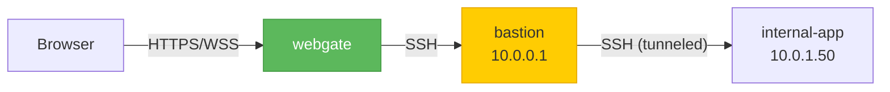
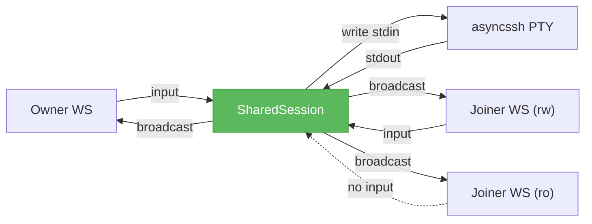

# Advanced features

## Jump host (SSH bastion)

When the target server is only reachable from a specific bastion (not directly from webgate), pick the bastion from the **Jump Via** dropdown in the Add/Edit Server form. webgate opens the SSH connection to the bastion first and tunnels the target connection through it using `asyncssh`'s native `tunnel=` parameter. The same tunnel is used for the SFTP browser.

The jump host must be registered in the server registry first so it has credentials. A cycle is prevented (server cannot point to itself); deeper chains (jumping through N bastions) are not supported yet — pick one.

## Command snippets

Each user has a personal library of named shell commands. They appear as buttons in the terminal toolbar — click to send `command + Enter` to the active session.

- **Create**: click the `+` button in the toolbar → enter name, command, optional description
- **Use**: click the named button → sent to the active terminal
- **Delete**: right-click a button → confirm

Snippets are stored in the `snippets` table scoped by user, so they're private.

## Shared terminal sessions

Click **🔗 Share** in the terminal toolbar of an active SSH session. A one-time URL is copied to your clipboard. Anyone you send it to will join the **same live PTY** — output is broadcast, input from any RW participant is multiplexed into the same `stdin`.

The share URL includes a `?join=<token>` query param — if the joiner isn't logged in yet, they land on the login screen and are auto-attached after login. If you close the owner tab, all joiners disconnect.

!!! note "HA limitation"
    In a multi-worker deployment (see [HA deployment](ha.md)), the owner and joiner must land on the same worker for the session to match. Sticky-session routing mitigates this for same-browser cases; fully cross-worker sharing needs Redis pub/sub (not yet implemented).

## Session recording

Set `WEBGATE_RECORD_SESSIONS=true` and every SSH terminal session is captured to a standard [asciinema cast v2](https://docs.asciinema.org/manual/asciicast/v2/) file under `WEBGATE_RECORDINGS_DIR` (default `./recordings`).

A new **📹 Recordings** button appears in the top toolbar:

- **▶ Play** opens an embedded asciinema-player tab that streams the cast directly from the API
- **DL** downloads the `.cast` file — you can also `asciinema play ./session.cast` locally
- **Del** removes the DB row and the file

Non-admins see only their own recordings; admins see everyone's. The recorder is hooked into `SharedSession.broadcast`, so shared sessions are captured exactly once (not once per participant).

!!! tip "Compliance"
    The recording captures the full PTY output every participant saw — including pasted commands and environment — in a portable, vendor-independent format. Good enough for many audit/compliance requirements without investing in a heavier SIEM.
