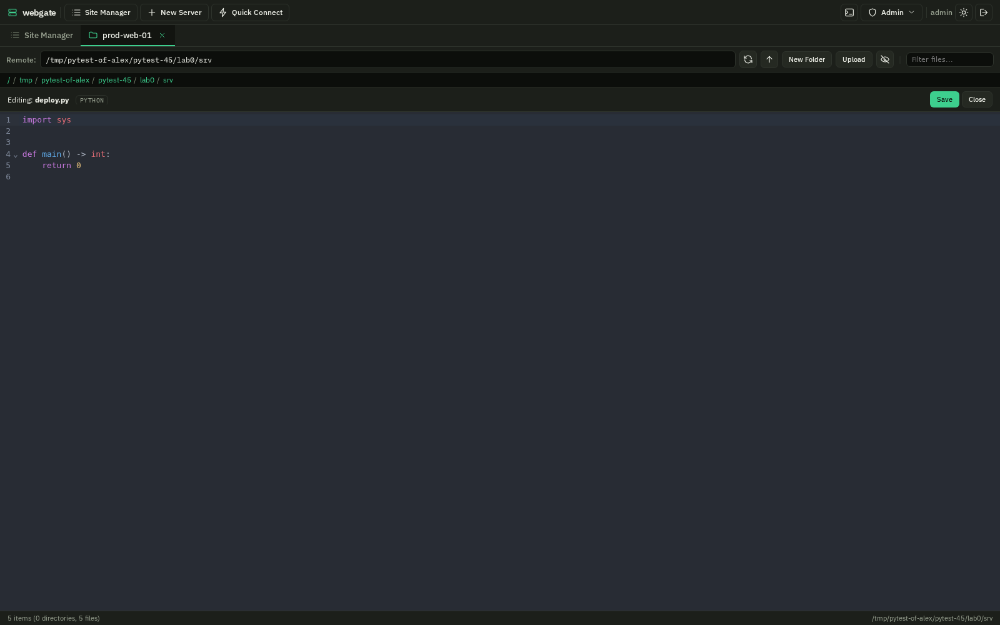

# SFTP File Browser

## Opening the File Browser

Click **SFTP** on any server in the Site Manager. A new tab opens showing the remote filesystem.

## Navigation

- **Click** a folder to enter it
- **Double-click** a file to open it in the editor
- **Breadcrumbs** at the top show the current path -- click any segment to jump there
- **Remote path bar** -- type a path directly and press Enter
- **Up arrow** button -- go to parent directory

## File Operations

| Action | How |
|--------|-----|
| **Upload** | Click Upload button or drag & drop files into the file list |
| **Download** | Right-click > Download, or use the DL button |
| **New Folder** | Click New Folder, enter name |
| **Rename** | Right-click > Rename |
| **Delete** | Right-click > Delete (with confirmation) |

## File Editor

Double-click any text file to open it in the **CodeMirror 6** editor: line numbers,
search and replace with `Ctrl+F`, and a **Save** button that writes back over SFTP.

### Syntax highlighting

The editor works out what it is looking at and loads that grammar -- and only that
one, the first time a file needs it. The language it settled on is shown next to the
filename, so when a file is not highlighted you can see that it was not recognised
rather than guess.

It covers Python, shell, JavaScript and TypeScript, JSON, YAML, TOML, SQL, XML, HTML,
CSS, Markdown, Go, Rust, C and C++, Java, PHP, Perl, Ruby, Lua, PowerShell,
Dockerfile, **nginx** and around eighty more.

Four things are tried, in order:

1. **The filename**, which settles almost everything -- extensions and names like
   `Dockerfile` alike.
2. **Template suffixes are peeled off**, so `nginx.conf.j2` and `settings.py.tmpl`
   are highlighted as what they will become. `.j2`, `.tmpl`, `.erb`, `.dist`,
   `.sample` and friends.
3. **Server conventions** the upstream list does not carry: `.conf` and `.cfg`,
   `.env`, systemd units (`.service`, `.timer`, `.socket`, `.mount`), apt and yum
   list files. A `.conf` with `nginx` in its name is treated as nginx.
4. **The shebang**, for the scripts in `/usr/local/bin` with no extension at all.
   `#!/bin/bash`, `#!/usr/bin/env python3` and the rest.

The editor follows the interface theme rather than being dark whatever you have
chosen.

## What the editor will not open

Some files are safer to leave alone than to open in a text editor, because saving one
is what destroys it.

| | What happens |
|---|---|
| **Binary files** | Refused. A file with a NUL byte in its first few KB -- an executable, an archive, a database -- would come back as replacement characters, and saving that would write them over the real contents. |
| **Text that is not UTF-8** | Refused. A latin-1 config has no NUL byte, but saving it would still rewrite every accented byte. |
| **Anything over 8 MB** | Refused by the browser, which holds the whole document in the page. Well under the transfer limit, which an admin sets separately. |
| **Anything over the transfer limit** | Refused by the gateway, the same ceiling every other transfer answers to. Admin -> Settings -> Security. |

In each case the file is named, the reason is on screen where the file would have
been, and a **Download** button is next to it. Nothing is silently truncated, and
nothing is silently rewritten.

## File Preview

These file types open in a preview instead of the editor:

| Type | Extensions |
|------|-----------|
| **PDF** | `.pdf` |
| **Images** | `.png`, `.jpg`, `.jpeg`, `.gif`, `.bmp`, `.svg`, `.webp` |

## Search / Filter

The filter input in the path bar lets you quickly find files by name in the current directory. Type to filter -- results update instantly.

## Connection Pool

SFTP connections are **reused** across requests to the same server (5 minute TTL). This means:

- First request: ~150ms (SSH handshake)
- Subsequent requests: ~15ms (reused connection)
