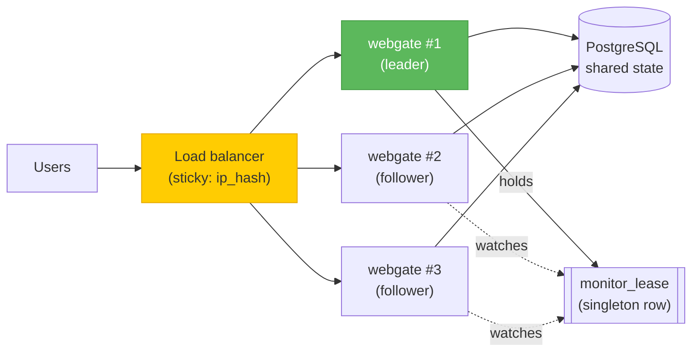

# High-availability deployment

Run N webgate workers behind a load balancer, all sharing one PostgreSQL database. Only one worker at a time probes server connectivity — leader election via a singleton lease row in the shared DB.



## Reference stack

The repo ships [`compose.ha.yml`](https://github.com/kalexnolasco/webgate/blob/main/compose.ha.yml) with 2 webgate replicas + Postgres + nginx (ip_hash sticky sessions):

```bash
export WEBGATE_SECRET_KEY=$(openssl rand -hex 32)
docker compose -f compose.ha.yml up -d
curl -s http://localhost:8443/api/health
# {"status":"ok","instance_id":"…","monitor_role":"leader"}
```

`/api/health` reports per-worker `instance_id` and current role. On leader loss, the lease expires within 90 s and another replica picks it up automatically.

## Env vars

| Variable | Default | Description |
|---|---|---|
| `WEBGATE_INSTANCE_ID` | auto-generated UUID | Stable identifier for this worker |
| `WEBGATE_DISABLE_MONITOR` | `false` | Skip leader election entirely |
| `WEBGATE_DB_URL` | SQLite | Must be `postgresql+asyncpg://…` for real HA |

## How it works

- `monitor_lease` table (auto-created at startup) holds the current leader's `instance_id` and expiry
- 90 s lease TTL with 30 s heartbeat
- On startup or lease expiry, any worker can claim. The first one to successfully `UPDATE` the row wins
- Followers still serve REST + WS traffic normally — only the probe loop is leader-only
- Dialect-agnostic (works on SQLite for dev, PostgreSQL for real HA)

## Known limitation

Live shared-terminal sessions still require the owner and joiner to land on the same worker (the `SharedSession` registry is per-process). Sticky-session routing handles same-browser joins; true cross-worker fan-out needs a Redis pub/sub layer, which is not yet implemented.
