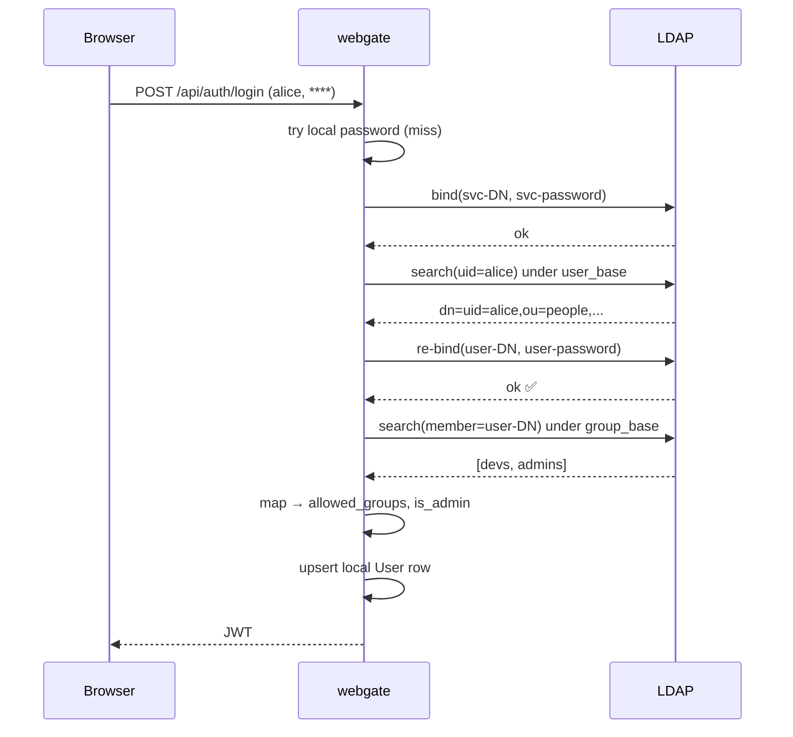

# Integrations

## Webhooks

Admins can register HTTPS endpoints that receive a JSON POST when significant events fire:

| Event | Fires on |
|---|---|
| `user_login` | Successful authentication (local or LDAP) |
| `user_login_failed` | Wrong username or password; payload username is sanitized (see below) |
| `ssh_connect` | A user opens an SSH terminal to a registered server |
| `sftp_upload` | Files uploaded via the SFTP browser |
| `sftp_delete` | Files / folders deleted via the SFTP browser |
| `server_added` | Admin creates a new server |
| `server_deleted` | Admin removes a server |

### Payload and signing

```
POST https://your-receiver.example.com/wh
Content-Type: application/json
X-Webgate-Signature: sha256=<hmac of body using the webhook's secret>
User-Agent: webgate-webhook/1.0

{
  "event": "ssh_connect",
  "timestamp": "2026-04-16T08:00:00Z",
  "data": {
    "user": "alice",
    "server": "prod-web-01",
    "host": "10.0.1.50:22",
    "via_jump": true
  }
}
```

The HMAC-SHA256 is computed with the per-webhook secret you configured. Receivers should use a constant-time compare (`hmac.compare_digest` in Python) to verify.

### Security of the dispatcher

- Delivery is fire-and-forget — a slow receiver never blocks the caller
- The `user_login_failed` payload sanitizes the attacker-controlled `username`: non-printable characters are stripped and the value is truncated to 64 chars, so a receiver that renders the field verbatim can't be targeted with terminal escapes or HTML
- Each webhook row records `last_fired_at` and `last_status` so admins can see delivery health from the UI

## LDAP / Active Directory

Enable with `WEBGATE_LDAP_ENABLED=true` and login falls back to LDAP after the local credential check. On success, the local `User` row is auto-provisioned or refreshed, and `allowed_groups` + `is_admin` are derived from LDAP group memberships via the mapping env vars.



See [access model](access-control.md) for how the LDAP group mapping turns into webgate `allowed_groups`.

### Config

| Variable | Default | Description |
|---|---|---|
| `WEBGATE_LDAP_ENABLED` | `false` | Enable LDAP fallback after local check |
| `WEBGATE_LDAP_URL` | `` | `ldap://host:389` or `ldaps://host:636` |
| `WEBGATE_LDAP_BIND_DN` | `` | Service account DN |
| `WEBGATE_LDAP_BIND_PASSWORD` | `` | Service account password |
| `WEBGATE_LDAP_USER_BASE` | `` | e.g. `ou=people,dc=example,dc=com` |
| `WEBGATE_LDAP_USER_FILTER` | `(uid={username})` | AD: `(sAMAccountName={username})` |
| `WEBGATE_LDAP_GROUP_BASE` | `` | Empty skips group lookup |
| `WEBGATE_LDAP_GROUP_FILTER` | `(member={dn})` | AD nested: `(member:1.2.840.113556.1.4.1941:={dn})` |
| `WEBGATE_LDAP_GROUP_MAP` | `{}` | JSON `{"ldap-cn":"webgate-group"}` |
| `WEBGATE_LDAP_ADMIN_GROUPS` | `[]` | JSON list of LDAP CNs that grant admin |

### Implementation notes

- Search-then-bind flow with proper RFC 4515 filter-value escaping
- All `ldap3` calls run in `asyncio.to_thread` to avoid blocking the event loop
- Local accounts (admin, API keys, 2FA) keep working as before — LDAP is only consulted after a local-credential miss
- Re-login refreshes admin status and group mapping from LDAP every time

## API keys

Admins and users can generate long-lived bearer tokens for non-interactive use (scripts, CI/CD, cron):

```bash
curl -H "Authorization: Bearer wg_<your-key>" \
     https://webgate.example.com/api/servers
```

Manage them from the **Keys** button in the top toolbar. Keys inherit the owning user's `allowed_groups` and `is_admin` status. Since v0.5.1, API keys cannot bypass a forced password change (`must_change_password=True`) — the owner has to rotate their password before the key becomes usable.

## Reverse proxy

webgate runs behind any modern HTTP reverse proxy. TLS termination is recommended in production.

For sub-path deployments (e.g. `https://example.com/webgate/`), set `WEBGATE_ROOT_PATH=/webgate` and **forward the prefix unchanged** — webgate handles `/webgate/api/...` natively.

Configs for nginx, Apache 2.4, Caddy and Traefik are in the [README](https://github.com/kalexnolasco/webgate#behind-a-reverse-proxy-with-tls).
