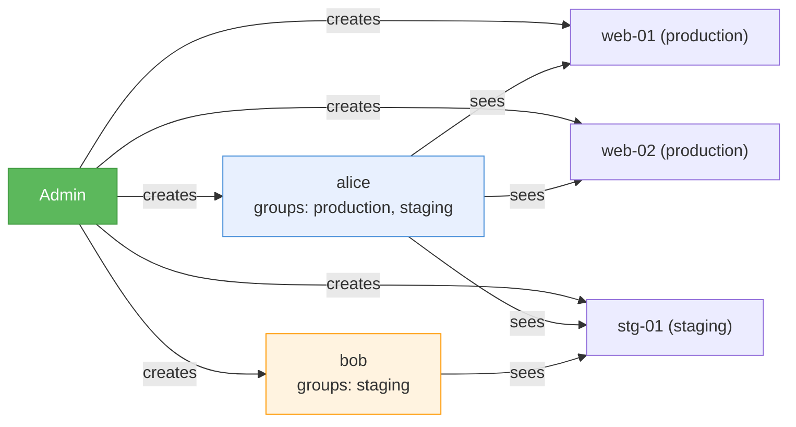

# User Management

## Roles

| Role | Capabilities |
|------|-------------|
| **Admin** | Full access: manage servers, users, view audit log |
| **User** | SSH/SFTP to servers in their allowed groups only |

## Default Admin

On first launch, webgate creates a default admin account:

- **Username:** `admin`
- **Password:** `admin`

!!! warning
    You must change this password on first login. The app will block all access until the password is changed.

## Creating Users

1. Login as admin
2. Click **Users** in the top bar
3. Fill in Username, Password, and Groups
4. Click **Add**

### Groups Assignment

Groups control which servers a user can see:

## Editing Groups

Click **Groups** on any user in the User Management panel to change their allowed groups. You can:

- Type group names separated by commas
- Click available group buttons to toggle them

## Audit Log

Admin can view all user actions by clicking **Audit** in the top bar:

- Login events
- SSH connections
- Server changes
- Timestamps and IP addresses
