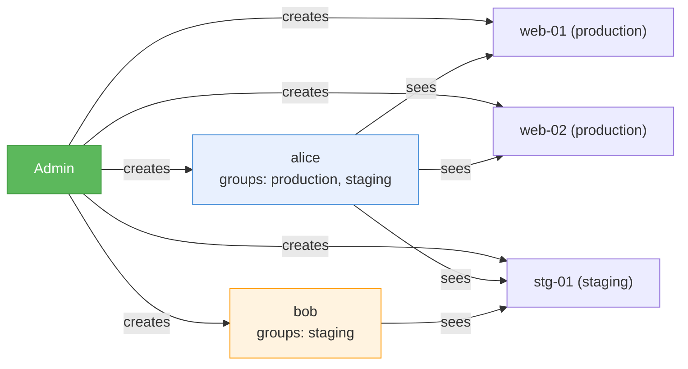
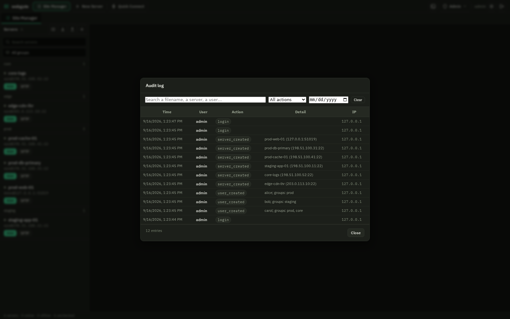

# User Management

## Roles

| Role | Capabilities |
|------|-------------|
| **Admin** | Full access: manage servers, users, view audit log |
| **User** | SSH/SFTP to servers in their allowed groups only |

## Default Admin

On first launch, webgate creates a default admin account:

- **Username:** `admin`
- **Password:** `admin`

!!! warning
    You must change this password on first login. The app will block all access until the password is changed.

## Creating Users

1. Login as admin
2. Click **Users** in the top bar
3. Fill in Username, Password, and Groups
4. Click **Add**

### Groups Assignment

Groups control which servers a user can see:

## Editing Groups

Click **Groups** on any user in the User Management panel to change their allowed groups. You can:

- Type group names separated by commas
- Click available group buttons to toggle them

## Audit log

**Admin → Audit log.** Every entry names the account, the action, what it touched, the
time and the originating IP.

| Recorded | Detail |
|---|---|
| `login` | Failed attempts fire a webhook; successful ones are logged |
| `ssh_connect` | The server and `host:port` |
| `sftp_delete`, `sftp_rename`, `sftp_write`, `sftp_mkdir`, `sftp_chmod` | The server and the full path. A rename records both names |
| `sftp_upload`, `sftp_download` | Every path involved, including the contents of a ZIP selection |
| `server_created`, `server_updated`, `server_deleted` | The server and, for an update, **which fields** changed — never their values, because one of them is a password |
| `user_created`, `user_deleted`, `user_groups_changed`, `user_password_reset` | Who changed whose access, and the groups before and after |
| `settings_update`, `settings_reset`, `branding_update`, `host_key_cleared`, `backup_export`, `backup_restore`, `agent_command` | The keys or the subject, not the secrets |

### Finding an entry

The question an operator arrives with is usually a filename, not an action kind, so the
search box matches the **detail** as well as the user and the action:

- type `nginx.conf` to see everything that touched it, whoever did it
- narrow by action with the dropdown, which lists only the kinds actually present
- set a **from** date to cut the history down

!!! note "What is deliberately not recorded"
    Directory listings and file previews. They are high volume and low signal, and
    burying a delete under ten thousand `ls` entries makes the log worse, not better.

!!! warning "Values are never logged"
    A server update records `changed: password, port` — not the password. A user's new
    password is never written down. If an entry could carry a secret, it carries the
    field name instead.
