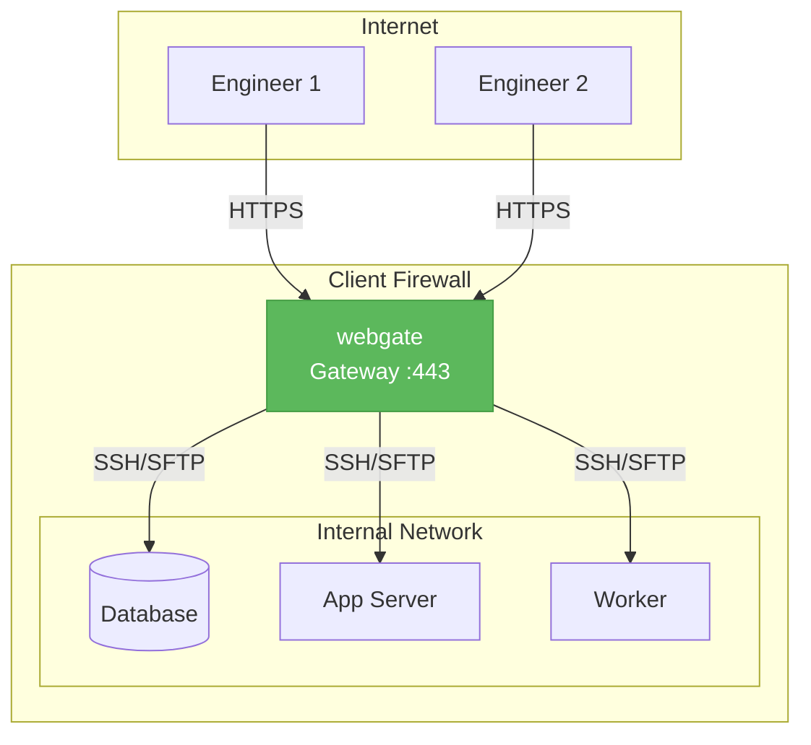

# webgate

**Self-hosted web gateway for remote server management.** SSH terminal, SFTP file browser, server registry with jump hosts, shared live sessions, asciinema session recording, LDAP/AD auth, webhooks, 2FA, and HA deployment — all from one browser tab.

!!! tip "Try it live"
    [webgate-demo.fly.dev](https://webgate-demo.fly.dev/) · login `demo` / `demo` (read-only sandbox, resets hourly)

!!! example "Quick start"
    ```bash
    export WEBGATE_SECRET_KEY=$(openssl rand -hex 32)
    docker compose up -d
    ```
    Then open `http://localhost:8443/` and log in with `admin / admin` (first login forces a password change).

## Why webgate?

Managing remote servers means juggling SSH clients, SFTP tools, credentials and VPN configs across your team. In many real-world setups **direct SSH access to every server isn't possible** — only HTTP(S) reaches the gateway.

Deploy webgate on the gateway and everyone gets browser-based SSH and SFTP to every internal server — no VPN, no scattered SSH keys, full audit trail.



## What's in the box

### Core
- **SSH terminal** in the browser (xterm.js + asyncssh), multi-tab, resize, copy/paste
- **SFTP file browser** with upload/download, drag & drop, ZIP folder download, in-browser editor (CodeMirror 6), PDF/image preview
- **Server registry** with groups, tags, password/key auth, encrypted at rest (Fernet), import/export JSON
- **Quick Connect** for one-off SSH/SFTP sessions
- **Split view** — terminal + file browser side by side

### Operations
- **SSH jump host / bastion** — chain SSH connections transparently; target only needs to be reachable from the bastion, not from webgate
- **Command snippets** — per-user library of named commands, one-click send to the active terminal
- **Shared terminal sessions** — click 🔗 Share, send a URL, a colleague joins the same live SSH session (broadcast output, multiplexed input)
- **Session recording** — every SSH session captured to an asciinema cast, browser replay included
- **Webhook notifications** — HMAC-signed POSTs on login, ssh_connect, server add/remove, sftp actions

### Auth & access control
- **JWT + bcrypt** locally, **2FA TOTP** per user, **API keys** for automation
- **LDAP / Active Directory** with group-to-role mapping and auto-provisioning
- **Per-server SSH/SFTP toggles**, SFTP path restrictions, read-only SFTP mode
- **Group-based visibility** — non-admins only see servers in their assigned groups
- **Audit log** (admin-viewable)

### Deployment
- **Docker** — multi-stage image, SQLite or PostgreSQL, runs behind any reverse proxy
- **Sub-path deployment** (`/webgate/`) with `WEBGATE_ROOT_PATH` + documented nginx / Apache / Traefik configs
- **Multi-instance HA** — N workers share a Postgres DB, leader election for the server monitor
- **Public demo mode** — `WEBGATE_DEMO_MODE=true` locks down writes and seeds a `demo`/`demo` user

## Where to go next

- **[Installation](getting-started/installation.md)** — pip, Docker, or from source
- **[Quick Start](getting-started/quickstart.md)** — 5-minute walkthrough
- **[Local playground](LOCAL_TESTING.md)** — full stack with LDAP + bastion + webhook receiver, exercises every feature
- **[API reference](api/auth.md)** — full REST + WebSocket surface
- **[Changelog](changelog.md)** — what's new in every release
