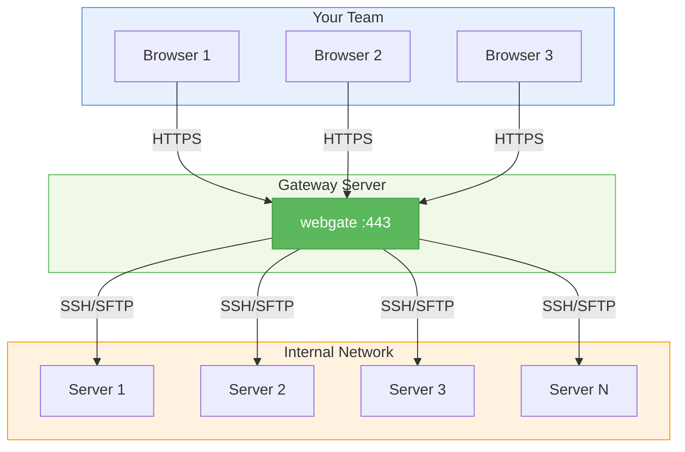

# webgate

**Self-hosted SSH terminal & SFTP file browser for remote server management.**

Deploy on a single gateway server and give your entire team browser-based access to every machine in the network -- no VPN, no local SSH clients, no credential files.

## Key Features

- **SSH Web Terminal** -- xterm.js powered terminal in your browser
- **SFTP File Browser** -- navigate, upload, download, edit files remotely
- **Server Registry** -- save servers with groups, tags, encrypted credentials
- **User Management** -- admin creates users and controls access by group
- **Split View** -- terminal + file browser side by side
- **Audit Log** -- track who did what and when
- **Docker Ready** -- single command to deploy

## Architecture



## Quick Install

```bash
git clone https://github.com/kalexnolasco/webgate.git
cd webgate
docker compose up -d
# Open http://localhost:8443 -- login: admin / admin
```

!!! warning "First Login"
    The default password `admin` must be changed on first login.

## Next Steps

- [Installation](getting-started/installation.md) -- all deployment options
- [Quick Start](getting-started/quickstart.md) -- step-by-step first use guide
- [Server Management](guide/servers.md) -- adding and organizing servers
